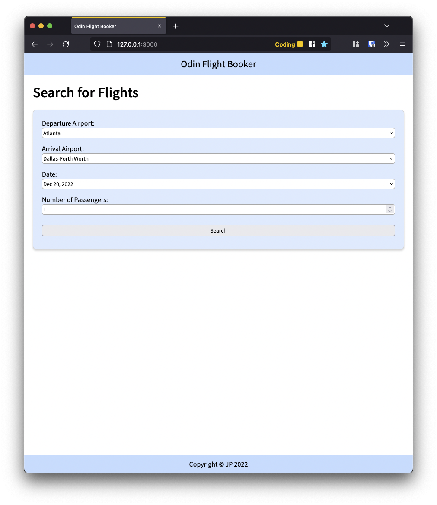
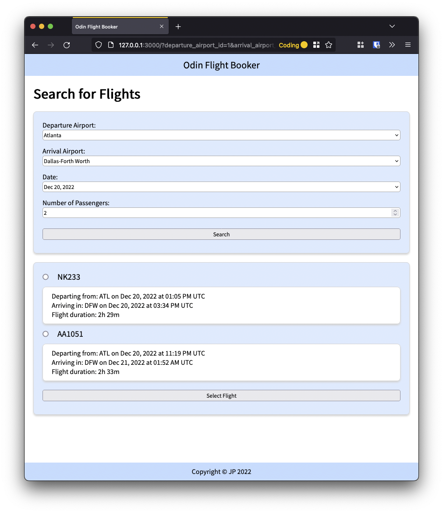
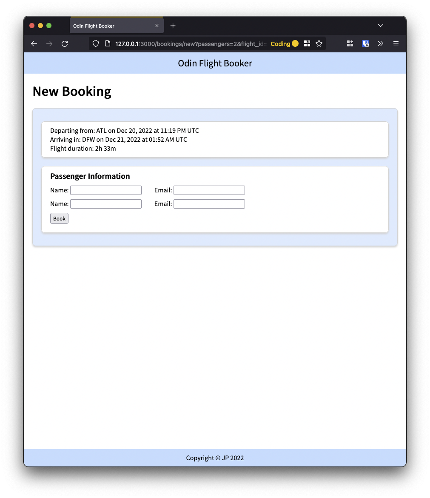
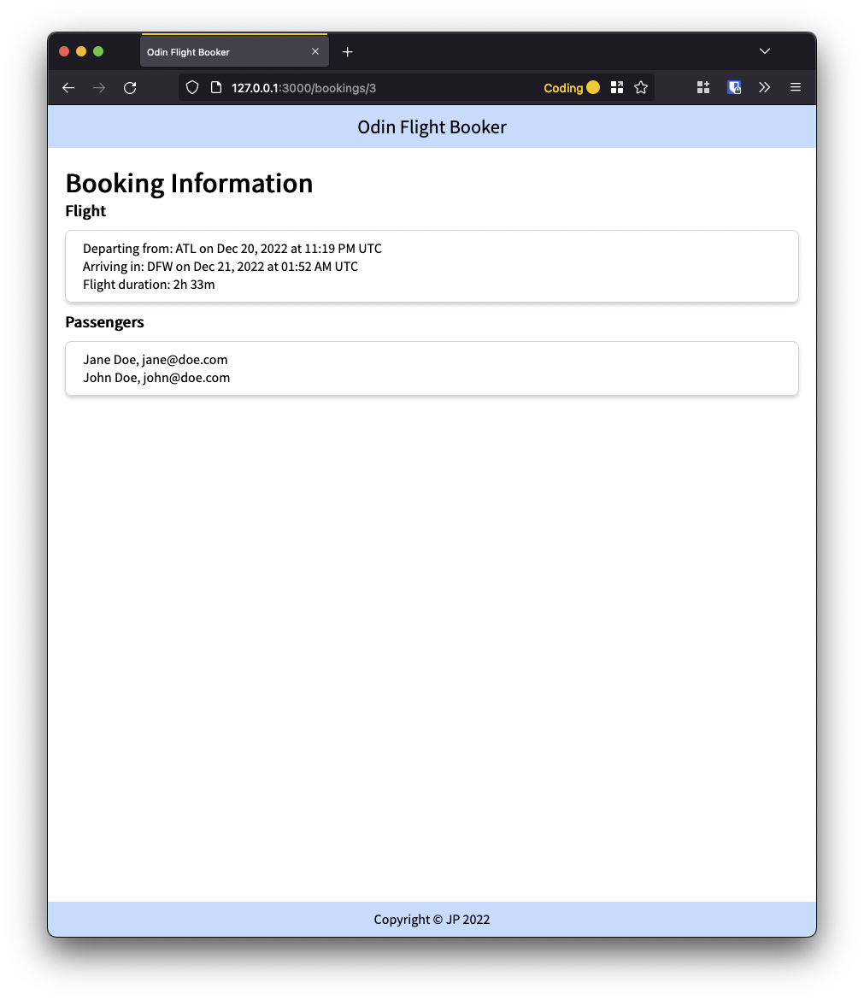

# Odin Flight Booker

Built as part of [The Odin Project's Full Stack Ruby on Rails](https://www.theodinproject.com/paths/full-stack-ruby-on-rails?) curriculum: [Project: Flight Booker](https://www.theodinproject.com/lessons/ruby-on-rails-flight-booker) lesson.

In this app a user can search for flights between ten major airports for a given date. Once a flight is selected, the user can proceed to book a flight.

Search Page | Search Results Page
:-------------------------:|:-------------------------:
 | 

New Booking Page | Booking Info Page
:-------------------------:|:-------------------------:
 | 

## Techniques Implemented
* Working with Airport, Flight, Booking and Passenger models using `belongs_to/has_many` relationships
* HTMLs form for event information, including collection selects, date and time
* Passing params between different models
* Methods in models to generate information from data entered
